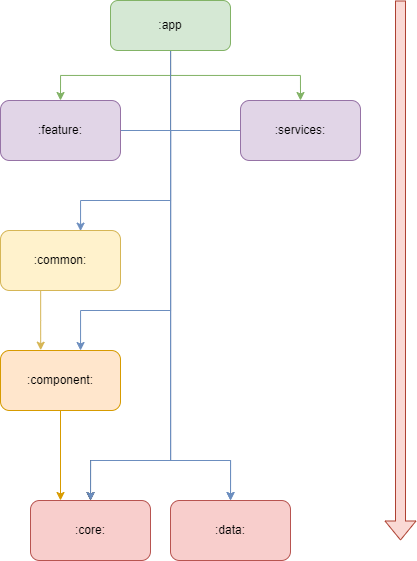

# Music club classic 
Music club - приложение для стриминга музыки из сервиса Youtube. Приложение позволяет находить и воспроизводить треки из популярной платформы, а так же сохранять любимые треки и альбомы.

# Цель проекта 📚
Приложение является демонстрацией моих навыков в андроид разработке с использованием популярных стеков технологий, а так же демонастрация знания архитектурных паттерно

Модуль Innertube, который отвечает за получение данных из сети разработан не мной.
Автор модуля: https://github.com/z-huang/InnerTune

# Скриншоты 📱

# Функционал 👀
1. Приложение предоставляет возможность находить и воспроизводить треки из Youtube.
3. Просматривать страницы авторов
4. Просматривать новые альбомы
5. Добавление треков в очередь воспроизведения
6. Фоновое воспроизведение треков
8. Бесконечная музыка

# Стек технологий 🧩
1. Kotlin
3. Dagger hilt
4. Glide
5. Exoplayer
6. Kotlin coorutine
7. Navigation component
8. Room
   
# Архитектура 🏗️
В приложении соблюдается (по крайней мере, я пытался 😌) Clean Artchitecture и используется паттерн проектирования MVVM.

Кроме того, проект разрабатывается в многомодульной стиле, так как в реальных проект, скорее всего будет так же. Такой подход позволяет лучше контролировать архитектуру, в лишний задуматься, а в правильном ли месте пишу код, может ли этот код понадобится и другии модулям и может лучше, вынести это как отдельную утилиту в слой ниже?

Проект изначально задумавывался сложным, с большим количеством экранов, и функционала, поэтому, очень много времени было потрачено на постоянное переписывание, рефакторинг кода, абстрагирование функций и создание новых модулей. Все это должно было минимизировать количество повторяющего кода и построить фундамент для дальнейшего расширения. Для решения этой задачи, я освоил следующие темы:
1. Delegate Adapter - этот паттерн испльзовался для создания сложных списков с различными ViewHolder. Для этого был создан CompositeAdapter, который подбирует нужный делегат, в завимимости от того, какое элемент (AdapterItem) ему нужно отобразить. 
2. Навигация - после перехода на многомодульность, я не сразу понял, каким образом можно выполнять навигацию между экранами, если каждый экран это отдельный feature модуль. Так как в интернете не было какой-то одной общепринятой идеи, я воспользовался простым вариантов: в каждом фрагменте есть интерфейс Navigator, который содержит все нужные методы для навигации, интерфейс реализуется в :app, а потом инжектится в экран.
3. DI - по ходу увеличения колличества классов и их зависимостей достаточно быстро возникло ощущения, что этим можно управлять. Dagger был выбран как самый популярный фреймвор, однако, при переходе на многомодульность стало понятно, что он слишком громоздкий, поэтому, он был заменен на более упрощенную версию Dagger Hilt, которые рекомендовался Google для многомодульных проектов.
4. Player - тема музыки была выбрана, чтобы так же научиться работать с медиаконтентом и фоновым воспроизведием. Для управления воспроизведением вместо bounded service использовалась обертка PlayerHandler, которая инжектилась в модули. В качестве плеера использовался Exoplayer так как он предоставляют широкие возможности настрокий потокового стриминга, хоть и пришлось повозиться с тем, как настраивать его источники, как кешировать данные и тд.
5. Чистая архитектура - как будто, больше всего именно на это и потратил времени. Переход на многомодульность как раз таки более строго следил, чтобы я случайно не использовал не те классы, где не нужно и чаще обстрагировать те функции, которые могут понадобится где-то еще. Для этого, я старался помечать внутренние классы как internal, а вне модули, я передавал только пограничный интерфейсы. Так как изначально, я планировал подключить не только Youtube, но и другие музыкальные сервисы, с старался максимально сильно обстрагировать дата классы от данных, которые приходят из ютуба. Поэтому, для бизнес логики использовал отедльные классы с препиской Model, они формируют из классов, которые приходит из DataSource, поэтому, если надо будет добавить или заменить источник, то изменится только логика создания Model. А для отображения данных, используются уже ui классы, наследные от AdapterItem (для оторжаения списком), котоыре содержат только те данные, которые увидит пользователь.

Тут перечислены в основном те темы, которые лично у меня вызывали сложности или в понимании или в реалиции или еще почему-то. Кроме них, я так же писал свои View, пользовался корутинами, базами данных, перебрасывал данные между экранами и тд, но конкретно в этом проекте, особых трудностей они не вызвали. 

в итоге, проект состоит из следующих модулей:
- `:app` - модуль приложения
- `:feature:` - содержит модули экранов
- `:data:` - содержит модули для получения данных
- `:common:` - содержит вспомогательные инструменты, например handler, делегаты, шаблоны экранов.
- `:core:` - содержит базовые компоненты приложения, например темы, ютулиты, базовые фрагменты и адаптеры
- `:component:` - содрежит кастомыне View
- `:service:` - содержит сервисы.

# Сборка
Проект не требует никаких особых правил для сборки. Достаточно просто скачать проект и запустить сборку через Android Studio.
